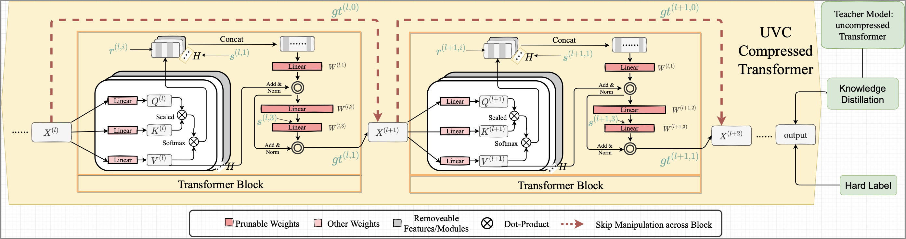

# Unified Vision Transformer Compression

[](https://opensource.org/licenses/MIT)

Codes for the paper: [ICLR 2022] [Unified Vision Transformer Compression](https://openreview.net/pdf?id=9jsZiUgkCZP).

Shixing Yu*, Tianlong Chen*, Jiayi Shen, Huan Yuan, Jianchao Tan, Sen Yang, Ji Liu, Zhangyang Wang


## Overall Results

Extensive experiments are conducted with several DeiT backbones on ImageNet, which consistently verify the effectiveness of our proposal. For example, UVC on DeiT-Tiny (with/without distillation tokens) yields around 50% FLOPs reduction, with little performance degradation (only 0.3%/0.9% loss compared to the baseline).

| Method         | Acc           | FLOPs(G) | Compression Ratio (%) |
| :------------- | :------------ | :------- | :-------------------- |
| DeiT-Small     | 79.8          | 4.6      | 100                   |
| SCOP           | 77.5 (-2.3)   | 2.6      | 56.4                  |
| PoWER          | 78.3 (-1.5)   | 2.7      | 58.7                  |
| HVT            | 78.0 (-1.8)   | 2.4      | 52.2                  |
| Patch Slimming | 79.4 (-0.4)   | 2.6      | 56.5                  |
| UVC (Ours)     | 79.44 (-0.36) | 2.65     | 57.61                 |
| UVC (Ours)     | 78.82 (-0.98) | 2.32     | 50.41                 |


## Overview of Proposed UVC

We formulate and solve UVC as a unified constrained optimization problem. It simultaneously learns model weights, layer-wise pruning ratios/masks, and skip configurations, under a distillation loss and an overall budget constraint.




## Implementations of UVC

### Set the Environment

```bash
conda create -n vit python=3.6

pip install torch==1.7.1+cu101 torchvision==0.8.2+cu101 torchaudio==0.7.2 -f https://download.pytorch.org/whl/torch_stable.html

pip install tqdm scipy timm
pip install ml_collections
pip install tensorboard

git clone https://github.com/NVIDIA/apex

cd apex

pip install -v --disable-pip-version-check --no-cache-dir --global-option="--cpp_ext" --global-option="--cuda_ext" ./

pip install -v --disable-pip-version-check --no-cache-dir ./
```


### Running command

The training contains two parts. 

* The first part is **UVC Training**. In this stage, it optimizes the architecture with primal-dual algorithm to find the optimal block-wise layout and skip configuration. 
* The second part is **Post Training**. In this stage, the architecture is fixed while only updating the weights to help the network to regain accuracy.

#### Stage1 UVC Training

```bash
python -W ignore -m torch.distributed.launch \
--nproc_per_node=2 \
--master_port 6019 joint_train.py \
--gpu_num '0,1' \
--uvc_train \
--model_type deit_tiny_patch16_224 \
--model_path https://dl.fbaipublicfiles.com/deit/deit_tiny_patch16_224-a1311bcf.pth \
--distillation-type soft \
--distillation-alpha 0.1 \
--train_batch_size 512 \
--num_epochs 30 \
--eval_every 1000 \
--flops_with_mhsa 1 \
--zlr_schedule_list "1,5,9,13,17" \
--learning_rate 1e-4 \
--enable_deit 0 \
--budget 0.5 \
--enable_pruning 1 \
--enable_block_gating 1 \
--enable_patch_gating 1 \
--gating_weight 5e-4 \
--patch_weight 5 \
--patch_l1_weight 0.01 \
--patchloss "l1" \
--use_gumbel 1 \
--glr 0.1 \
--patchlr 0.01 \
--num_workers 64 \
--seed 730 \
--output_dir mc_deit_tiny_patch16_224_with_patch \
--log_interval 1000 \
--eps 0.1 \
--eps_decay 0.92 \
--enable_warmup 1 \
--warmup_epochs 5 \
--warmup_lr 1e-4 \
--z_grad_clip 0.5 \
--gating_interval 50
```

#### Stage2 Post Training

```bash
python -m torch.distributed.launch \
--nproc_per_node=2 --master_port 6382 post_train.py \
--pretrained 0 \
--model_type "deit_small_patch16_224" \
--model_path https://dl.fbaipublicfiles.com/deit/deit_small_patch16_224-cd65a155.pth \
--checkpoint_dir /home/shixing/deit_small_patch16_224_11.pth.tar \
--distillation-type soft \
--distillation-alpha 0.1 \
--train_batch_size 256 \
--gpu_num '2,3' \
--epochs 120 \
--eval_every 1000 \
--output_dir exp/deit_small_nasprune_0.58 \
--num_workers 64
```


## Citation

```
@inproceedings{yu2022unified,
  author = {Yu, Shixing and Chen, Tianlong and Shen, Jiayi and Yuan, Huan and Tan, Jianchao and Yang, Sen and Liu, Ji and Wang, Zhangyang},
  title = {Unified Visual Transformer Compression},
  booktitle = {ICLR},
  year = {2022},
}
```

## Results

Our full compression log for reported results are under file log/.

Checkpoint of deit-tiny-patch16-224: https://drive.google.com/drive/folders/1kjhNsppWCLuaGm-fAf4tVbVRENL14PeD?usp=sharing


## Acknowledgement

ViT : https://github.com/jeonsworld/ViT-pytorch

ViT : https://github.com/google-research/vision_transformer

DeiT: https://github.com/facebookresearch/deit

T2T-ViT: https://github.com/yitu-opensource/T2T-ViT
